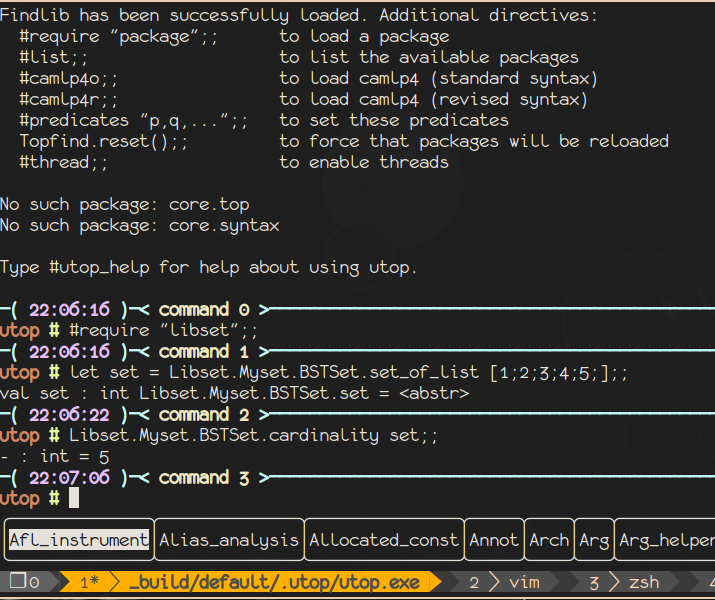

## An O-Caml Set implementation

This is a dune project with an Implementation of A Set and Tree as self-exercise
when learning ocaml.

### Instructions

#### Requirements

- The OCaml toplevel, version 4.11.1
- Base libraries

#### Usage

```ocaml

open Libset;;

Libset.Mytree.MyTree.(* Tree operation *)
Libset.Myset.MySet.(* Set operation *)

```

To use in utop

```bash
$ dune build --auto-promote
$ dune utop # use #require "libset" to load in toplevel
```




### References

<https://www.seas.upenn.edu/~cis120/archive/16sp/lectures/lec10.pdf>
<https://gist.github.com/owainlewis/3829544>

